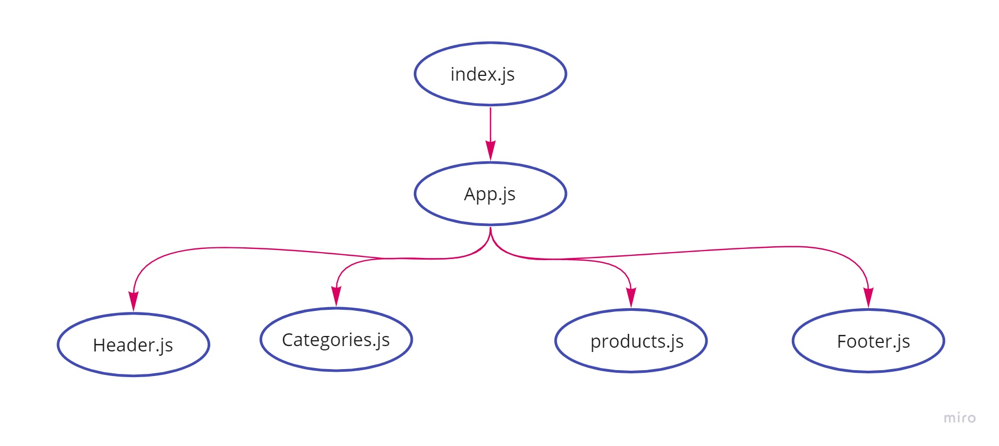
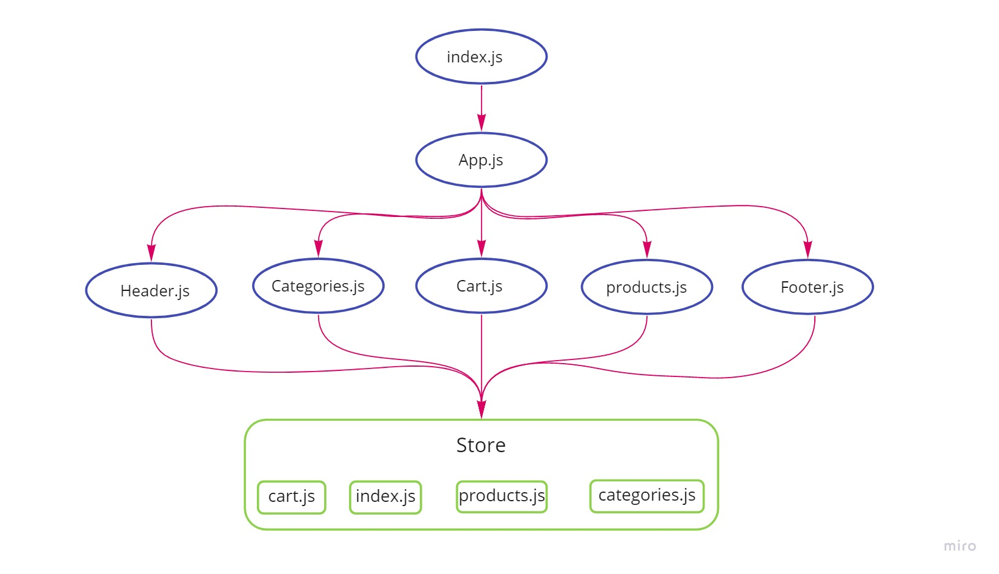
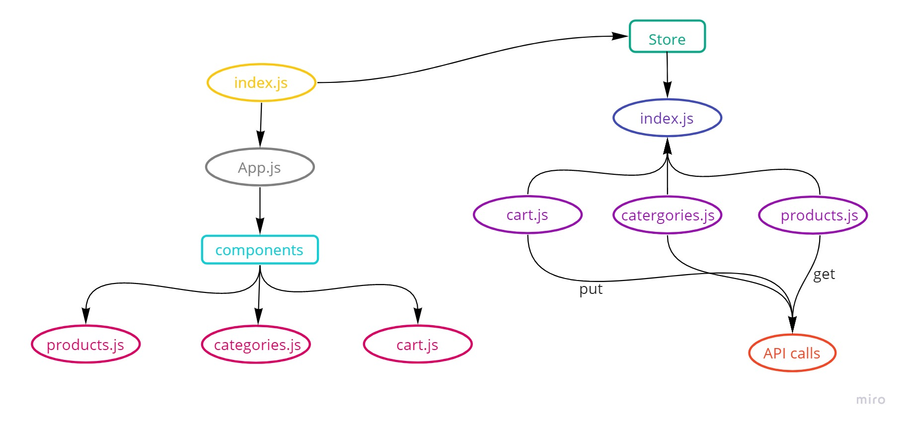

# storefront

An online shopping portal for a fictional store

## Technologies
 - React
 - Redux
 - Material UI

## PreRequiesites:
 * npm i
- To start the application type in the terminal : npm start
- For testing type in the terminal : npm test

## Virtual Store Phase 1:
For this assignment, you will be starting the process of creating an e-Commerce storefront using React with Redux, coupled with your live API server

## UML1:

## Virtual Store Phase 2:
Continue work on the e-Commerce storefront, breaking up the store into multiple reducers and sharing functionality/data between components

## UML2:

 

## Virtual Store Phase 3:
Connect the Virtual Store to an API to retrieve live data from your data source, using thunk to enable asynchronous actions

## UML3:

 